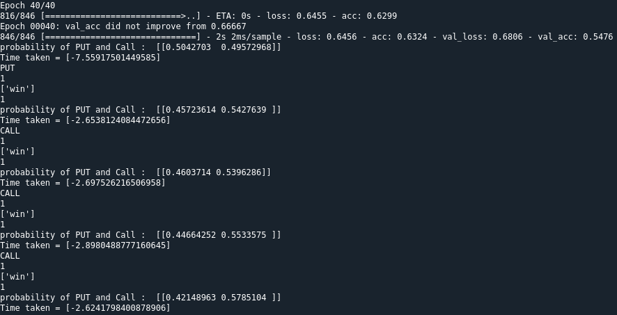

Opções binárias são operações financeiras que buscam lucros de curtíssimo prazo apostando na subida ou descida dos preços de um ativo financeiro – daí o nome binário, porque só pode subir ou descer.

Na IqOption, usualmente recebe-se um pagamento de 1.85 o valor investido, caso a operação seja bem sucedida. Caso contrário, o investidor perde todo o valor investido.

Séries temporais financeiras são, por natureza, passeios aleatórios. Isso significa que os preços de um ativo financeiro não seguem uma tendência, mas sim uma trajetória aleatória. Isso é um problema para quem quer prever o futuro, mas é uma vantagem para quem quer ganhar dinheiro com isso.

Opções binárias operadas no curtíssimo prazo, como faremos aqui, se assemelham muito a apostas em jogos de azar (~70% das pessoas perdem dinheiro com essa modalidade de investimentos), por isso trataremos esses investimentos aqui como apostas.

A ideia é utilizar uma estratégia martingale variável com stop loss, para controlar o risco de perder tudo. No arquivo martingale.xlsx você encontrará os cálculos (feitos com o solver) para tentar maximizar a esperança líquida, dados alguns parâmetros:

- Valor inicial do investimento;
- Multiplicador martingale inicial (valor que a aposta inicial crescerá após uma loss);
- Taxa de crescimento do multiplicador;
- Valor do stop loss (quantas loses seguidas antes de parar);
- Acurácia do modelo;
- Retorno da IqOption por win.

Como temos um problema binário, por natureza teremos 50% de acertos. Entretanto, como a corretora oferece 85% de retorno em wins e 0% em losses, é necessário aumentar a taxa de acertos para, pelo menos, zerar a esperança líquida. Pelos cálculos iniciais, é necessário pelo menos 53% de acertos para que isso aconteça.

Dessa forma, a ideia é tentar modelar uma série temporal aparentemente aleatória (que, na verdade, parece ser uma série temporal com tendências e MUITO ruído) e conseguir um modelo em que a acurácia seja superior aos 53% mínimos



## Conteúdo
- [Setup](#Setup)
- [Data](#Data)
- [Getting started](#Getting_started)

## Setup

Recomendo clonar o projeto e criar um venv para evitar conflito com outros projetos.
Com o Terminal na pasta do projeto, execute:

Para ativar o venv:
```shell
venv\Scripts\activate.bat
```

Para instalar as dependências:
```shell
pip install -r requirements.txt
```

O acompanhamento do modelo está sendo feito pelo PowerBI, então, caso queria acompanhar os logs, é necessário instalar o PowerBI Desktop e configurar o caminho do arquivo log.txt para o seu computador.

## Dados

Os dados são provenientes da IqOption, obtidos através da iqoptionapi. A api limita a 1000 registros extraídos por vez, então trabalharemos com isso nessa versão. Nas versões mais recentes foi implementado o uso do MongoDB para armazenar os dados, principalmente para treinar novos modelos.

## Getting started

Para efeito de teste foi criado o usuário 'ml.puc.teste@hotmail.com' e senha 'puc.1234' na IqOption. O arquivo main.py já está configurado para rodar normalmente, assim que as dependências forem instaladas.

No arquivo robot.py encontrará todas as etapas de extração dos dados da API, feature engineering e treino/retreino do modelo.
Adicionei comentários a cada etapa para facilitar a compreensão do código e explicitar a linha de pensamento nos momentos

Está sendo utilizado uma RNN com LSTM para tentar modelar a série temporal. Nessa implementação estão sendo utilizados poucos dados da API somente para efeito de demonstração (porém a acurácia no projeto real está igualmente ruim kkkkk)

## License

[](http://badges.mit-license.org)

- **[MIT license](http://opensource.org/licenses/mit-license.php)**
